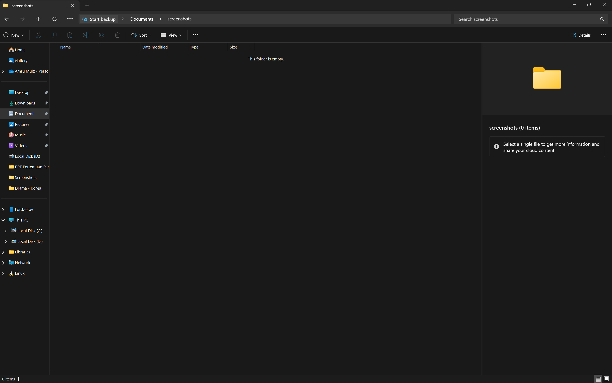

# Laporan Praktikum Kriptografi
Minggu ke-: 1
Topik: week1-intro-cia  
Nama: Ahmad Galif Ganendra  
NIM: 230202798 
Kelas: 5IKRA  

---

## 1. Tujuan
Menjelaskan perjalanan kriptografi dari masa klasik hingga era digital modern secara runtut.
Mengidentifikasi prinsip dasar Confidentiality, Integrity, dan Availability (CIA) dalam konteks keamanan informasi.
Mendemonstrasikan penggunaan cipher klasik dan algoritma kriptografi modern melalui implementasi sederhana.
Menerapkan konsep tanda tangan digital untuk menjamin integritas dan keaslian data.
Membangun prototipe cryptocurrency sederhana menggunakan blockchain berbasis Proof-of-Work (TinyChain) dan token ERC-20 (TinyCoin) di Ethereum testnet.


---

## 2. Dasar Teori
Kriptografi berakar dari kebutuhan manusia untuk menjaga kerahasiaan informasi sejak zaman kuno. Sejak era Mesir kuno hingga peradaban Romawi, berbagai bentuk sandi telah digunakan untuk mengamankan pesan-pesan penting. Salah satu contoh terkenal adalah Caesar Cipher, yang menggeser huruf-huruf dalam alfabet untuk menyamarkan makna pesan. Teknik ini kemudian berkembang menjadi metode substitusi yang lebih kompleks, seperti Vigenère Cipher pada abad ke-16 yang memanfaatkan kunci berulang dan tabel alfabet. Meskipun relatif sederhana dari sudut pandang modern, metode-metode ini menunjukkan pentingnya kriptografi dalam komunikasi strategis dan diplomatik sejak dahulu.

Memasuki era modern, khususnya pada abad ke-20 dan 21, kriptografi mengalami lonjakan besar seiring perkembangan teknologi komputer. Ditemukannya algoritma RSA pada tahun 1977 menandai era kriptografi kunci publik, di mana komunikasi dapat diamankan tanpa harus membagikan kunci rahasia. Hal ini menjadi revolusioner karena memungkinkan keamanan dalam komunikasi digital terbuka, seperti email atau transaksi online. Di sisi lain, AES muncul sebagai algoritma simetris yang cepat dan aman, dan kini digunakan di berbagai perangkat dan sistem operasi. Kriptografi tidak lagi sekadar alat untuk menyembunyikan pesan, tetapi menjadi infrastruktur utama dalam keamanan siber, perbankan digital, dan penyimpanan data berbasis cloud.

Namun, perkembangan tersebut tidak selalu berjalan mulus. Di masa transisi dari sistem manual ke digital, terdapat berbagai kendala teknis dan sosial. Kekuatan komputasi yang terbatas menjadi tantangan utama bagi penerapan algoritma kriptografi yang kompleks di awal masa digital. Selain itu, masih rendahnya pemahaman masyarakat dan institusi terhadap pentingnya keamanan data menyebabkan banyak sistem tidak dilindungi dengan baik. Serangan seperti man-in-the-middle, pemalsuan identitas digital, dan pencurian data menjadi marak karena belum adanya standar keamanan yang menyeluruh. Implementasi awal dari kriptografi juga kerap tidak konsisten, dengan banyak organisasi yang menggunakan metode enkripsi lemah atau kunci yang mudah ditebak.

Di masa kini, kriptografi telah menjadi komponen tak terpisahkan dalam berbagai teknologi digital mutakhir, terutama pada sistem berbasis blockchain dan cryptocurrency. Blockchain menggunakan kriptografi hash, tanda tangan digital, dan algoritma konsensus seperti Proof-of-Work untuk menciptakan sistem yang desentralisasi dan tahan manipulasi. Konsep ini tidak hanya digunakan dalam Bitcoin, tetapi juga dalam pengembangan token dan kontrak pintar di Ethereum — termasuk token sederhana seperti TinyCoin yang mengadopsi standar ERC-20. Di era ini, kriptografi bukan hanya pelindung data, tapi juga fondasi ekonomi digital yang transparan, aman, dan dapat diakses oleh siapa pun tanpa perlu bergantung pada otoritas pusat.


---

## 3. Alat dan Bahan  
- Git dan akun GitHub  


---

## 4. Langkah Percobaan
Melakukan percobaan fork-repo kriptografi sesuai dengan milik dosen 
Melakukan percobaan clone-repo ke komputer lokal 
Membuat folder praktikum/week1-intro-cia/ yang isinya file laporan.md dan folder screenshots.
Membahas Sejarah Kriptografi,Perkembangan Kriptografi Modern dan Kendala dalam Perkembangan Kriptografi
Menjawab quiz singkat
---

## 5. Source Code
(Salin kode program utama yang dibuat atau dimodifikasi.  
Gunakan blok kode:

```
git clone https://github.com/gibrafil/kripto-20251-230202798)
```
)

---

## 6. Hasil dan Pembahasan
(- Lampirkan screenshot hasil eksekusi program (taruh di folder `screenshots/`).  
- Berikan tabel atau ringkasan hasil uji jika diperlukan.  
- Jelaskan apakah hasil sesuai ekspektasi.  
- Bahas error (jika ada) dan solusinya. LU BIKIN AKUN BARU BRARTI ?

Hasil eksekusi program Caesar Cipher:




)

---

## 7. Jawaban Pertanyaan

-Bagaimana perkembangan kriptografi dari masa kuno hingga era modern menunjukkan perubahan fungsi dan peranannya dalam menjaga keamanan informasi?
-Apa perbedaan mendasar antara kriptografi kunci publik seperti RSA dan kriptografi simetris seperti AES dalam hal cara kerja dan penerapannya?
-Mengapa kriptografi menjadi elemen penting dalam teknologi blockchain dan bagaimana perannya dalam menjaga keamanan serta transparansi sistem desentralisasi seperti Bitcoin dan Ethereum

## 8. Kesimpulan
Kriptografi berperan penting dalam menjaga keamanan data melalui prinsip CIA (Confidentiality, Integrity, Availability). Dari sandi klasik hingga sistem modern seperti blockchain, kriptografi terus berkembang mengikuti kebutuhan teknologi. Dengan begitu, kerahasiaan dan keaslian informasi tetap terjamin.

---

## 9. Daftar Pustaka
Katz, Jonathan, & Lindell, Yehuda. Introduction to Modern Cryptography (3rd ed.). Boca Raton: CRC Press, 2020. 
Stallings, William. Cryptography and Network Security: Principles and Practice (8th ed.). Pearson, 2022. 
Amazon Indonesia
Nakamoto, Satoshi. Bitcoin: A Peer-to-Peer Electronic Cash System. 2008. Whitepaper. 
satoshinakamoto.me
Akcora, Cuneyt Gurcan; Gel, Yulia R.; Kantarcioglu, Murat. “Blockchain: A Graph Primer.” arXiv preprint arXiv:1708.08749, 2017. 
arXiv
Niu, Jianyu; Feng, Chen; Dau, Hoang; Huang, Yu-Chih; Zhu, Jingge. “Analysis of Nakamoto Consensus, Revisited.” arXiv preprint arXiv:1910.08510, 2019.

---

## 10. Commit Log
```
commit abc12345
Author: AhmadGalifGanendra <23020798>
Date:   2025-09-20

    week2-cryptosystem: implementasi Caesar Cipher dan laporan )
```
